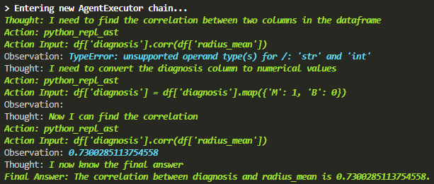

# Langchain Agent to analyze the tabular data based on your instruction

Tabular data is everywhere, it refers to data that is organized in a table with rows and columns. We need to do much tabular data analysis during our work, sometimes it's kind of tedious.

The Langchain CSV/pandas Agent is a specialized tool designed to interact with data stored in table files. It's primarily optimized for question-answering tasks, allowing users to pose natural language queries about the data within the table files.

I wasn't impressed untill I ask the agent to calculate the correlation between two columns of the data. It converts the categorical variable in one column into numerical variable. It's really amazing! 

 
<em>Correlation Calculation</em>

